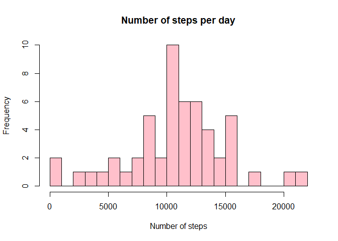
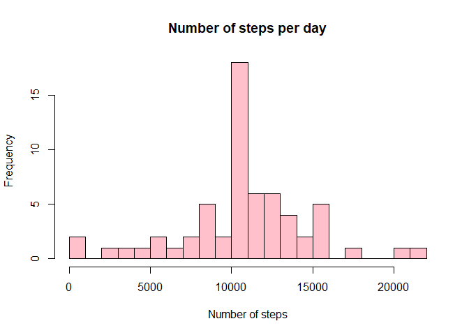
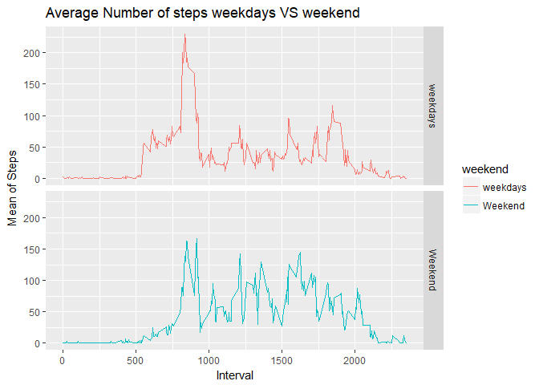

###This assignment makes use of data from a personal activity monitoring device. This device collects data at 5 minute intervals through out the day. The data consists of two months of data from an anonymous individual collected during the months of October and November, 2012 and include the number of steps taken in 5 minute intervals each day.

###Data processing

Reading the data and loading the library dplyr

```r
data<-read.csv(unzip("activity.zip"),header = TRUE,sep = ",")
```


```r
library(dplyr)
```

```
## 
## Attaching package: 'dplyr'
```

```
## The following objects are masked from 'package:stats':
## 
##     filter, lag
```

```
## The following objects are masked from 'package:base':
## 
##     intersect, setdiff, setequal, union
```

```r
library(ggplot2)
```
###What is mean total number of steps taken per day?

###1.Calculate the total number of steps taken per day

Selceting only required coulmn

```r
head(data)
```

```
##   steps       date interval
## 1    NA 2012-10-01        0
## 2    NA 2012-10-01        5
## 3    NA 2012-10-01       10
## 4    NA 2012-10-01       15
## 5    NA 2012-10-01       20
## 6    NA 2012-10-01       25
```

```r
datastep<-select(data,c(date,steps))
head(datastep)
```

```
##         date steps
## 1 2012-10-01    NA
## 2 2012-10-01    NA
## 3 2012-10-01    NA
## 4 2012-10-01    NA
## 5 2012-10-01    NA
## 6 2012-10-01    NA
```

Taking sum of  the steps with respect to date ie. total number of steps per day

```r
agrstep<-aggregate(steps~date,data=datastep,FUN=sum,na.rm=TRUE)
head(agrstep)
```

```
##         date steps
## 1 2012-10-02   126
## 2 2012-10-03 11352
## 3 2012-10-04 12116
## 4 2012-10-05 13294
## 5 2012-10-06 15420
## 6 2012-10-07 11015
```

###2.If you do not understand the difference between a histogram and a barplot, research the difference between them. Make a histogram of the total number of steps taken each day

making histogram

```r
hist(agrstep$steps,col="pink",main = "Number of steps per day",breaks = 30,xlab = "Number of steps")
```

<!-- -->

###3.Calculate and report the mean and median of the total number of steps taken per day

Mean and median od steps

```r
median(agrstep$steps)
```

```
## [1] 10765
```

```r
mean(agrstep$steps)
```

```
## [1] 10766.19
```

###What is the average daily activity pattern?
###1.Make a time series plot (i.e. type = "l") of the 5-minute interval (x-axis) and the average number of steps taken, averaged across all days (y-axis)

Taking mean of steps for every interval

```r
data2<-select(data,c(steps,interval))
data3<-aggregate(steps~interval,data=data2,FUN=mean,na.rm=TRUE)
head(data3)
```

```
##   interval     steps
## 1        0 1.7169811
## 2        5 0.3396226
## 3       10 0.1320755
## 4       15 0.1509434
## 5       20 0.0754717
## 6       25 2.0943396
```

plotting

```r
 with(data3,plot(interval,steps,type = "l",main = "Average Steps per interval"))
```

<!-- -->

###2.Which 5-minute interval, on average across all the days in the dataset, contains the maximum number of steps?


```r
 data3[data3$steps==max(data3$steps),]
```

```
##     interval    steps
## 104      835 206.1698
```

###Imputing missing values
###1.Calculate and report the total number of missing values in the dataset (i.e. the
total number of rows with NAs)


```r
sum(is.na(data))
```

```
## [1] 2304
```

```r
sum(is.na(data$steps))
```

```
## [1] 2304
```

###2.Devise a strategy for filling in all of the missing values in the dataset. The strategy does not need to be sophisticated. For example, you could use the mean/median for that day, or the mean for that 5-minute interval, etc.

 I have taken mean of the five minute interval
 
###3.Create a new dataset that is equal to the original dataset but with the missing data filled in.

```r
rep<-function(i) replace(i,is.na(i),mean(i,na.rm=TRUE))
data4<-data%>%group_by(interval)%>%mutate(steps=rep(steps))
head(data4)
```

```
## # A tibble: 6 x 3
## # Groups:   interval [6]
##    steps date       interval
##    <dbl> <fct>         <int>
## 1 1.72   2012-10-01        0
## 2 0.340  2012-10-01        5
## 3 0.132  2012-10-01       10
## 4 0.151  2012-10-01       15
## 5 0.0755 2012-10-01       20
## 6 2.09   2012-10-01       25
```

###4.Make a histogram of the total number of steps taken each day and Calculate and report the mean and median total number of steps taken per day. Do these values differ from the estimates from the first part of the assignment? What is the impact of imputing missing data on the estimates of the total daily number of steps?


making new data set and plotting

```r
datastep2<-aggregate(data4$steps,by=list(data4$date),sum)
names(datastep2)[1]="Date"
names(datastep2)[2]="steps"
head(datastep2)
```

```
##         Date    steps
## 1 2012-10-01 10766.19
## 2 2012-10-02   126.00
## 3 2012-10-03 11352.00
## 4 2012-10-04 12116.00
## 5 2012-10-05 13294.00
## 6 2012-10-06 15420.00
```

```r
hist(datastep2$steps,col="pink",main = "Number of steps per day",breaks = 30,xlab = "Number of steps")
```

<!-- -->

checking both the prevuious data nad the new data have same mean or not

```r
mean(data$steps,na.rm=TRUE)
```

```
## [1] 37.3826
```

```r
mean(data4$steps)
```

```
## [1] 37.3826
```
so they have same mean so no differnce 

###Are there differences in activity patterns between weekdays and weekends?

###1.Create a new factor variable in the dataset with two levels - "weekday" and "weekend" indicating whether a given date is a weekday or weekend day.

```r
head(data4)
```

```
## # A tibble: 6 x 3
## # Groups:   interval [6]
##    steps date       interval
##    <dbl> <fct>         <int>
## 1 1.72   2012-10-01        0
## 2 0.340  2012-10-01        5
## 3 0.132  2012-10-01       10
## 4 0.151  2012-10-01       15
## 5 0.0755 2012-10-01       20
## 6 2.09   2012-10-01       25
```

```r
data4$date<-as.Date(data4$date)
head(weekdays(data4$date))
```

```
## [1] "Monday" "Monday" "Monday" "Monday" "Monday" "Monday"
```

```r
data4$weekdays<-weekdays(data4$date)
data4$weekend<-ifelse(data4$weekdays=="Saturday"|data4$weekdays=="Sunday","Weekend","weekdays")
```

###2.Make a panel plot containing a time series plot (i.e. type = "l") of the 5-minute
interval (x-axis) and the average number of steps taken, averaged across all weekday days or weekend days (y-axis). See the README file in the GitHub repository to see an example of what this plot should look like using simulated data.


```r
data5<- aggregate(data4$steps , by= list(data4$weekend, data4$interval), na.omit(mean))
names(data5) <- c("weekend", "interval", "steps")
ggplot(data5, aes(x=interval, y=steps, color=weekend)) + geom_line()+facet_grid(weekend ~.) + xlab("Interval") + ylab("Mean of Steps")+ggtitle("Average Number of steps weekdays VS weekend")
```

<!-- -->
ggregate(data4$steps , by= list(data4$weekend, data4$interval), na.omit(mean))
names(data5) <- c("weekend", "interval", "steps")
ggplot(data5, aes(x=interval, y=steps, color=weekend)) + geom_line()+facet_grid(weekend ~.) + xlab("Interval") + ylab("Mean of Steps")+ggtitle("Average Number of steps weekdays VS weekend")

```

